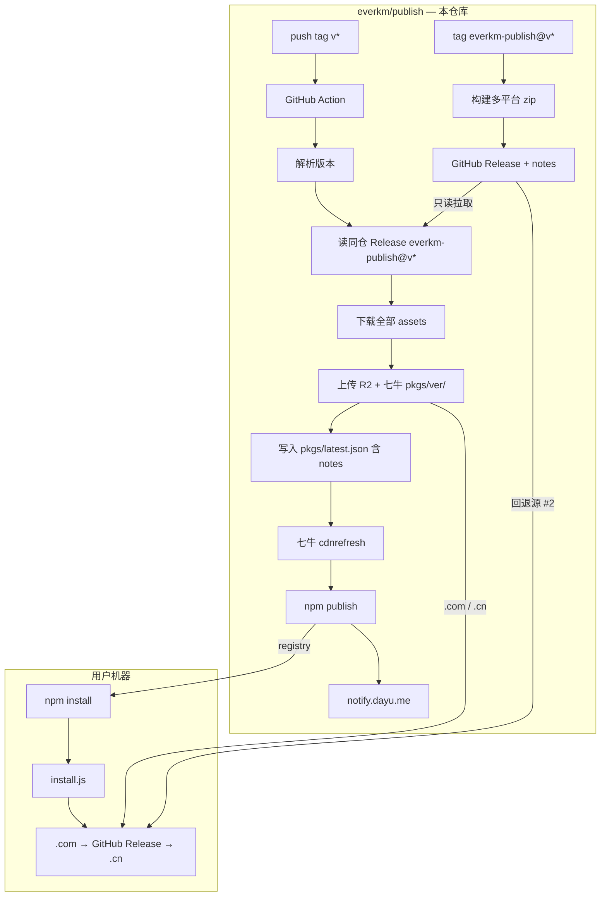

# everkm/publish — CDN 分发与自动 npm 发布 — 架构设计（Plan）

> **文档性质**：目标架构 + 职责拆分方案（2026-06-13）  
> **仓库**：GitHub [`everkm/publish`](https://github.com/everkm/publish)（`everkm-publish-npm` 仅为本地/历史别名，非独立仓库）  
> **状态**：**已实施**（2026-06-13）  
> **关联**：[ekmp-themes 架构设计](../../../ekmp-themes/stuff/km/260612-架构设计.md)、[publish-theme.py](../../../ekmp-themes/scripts/publish-theme.py)、[publish-theme workflow notify](../../../ekmp-themes/.github/workflows/publish-theme.yaml)、[install.js](../../install.js)、[npm 发布问题记录](./npm-publish-everkm-publish-0.16.9.md)

---

## 0. 变更记录

| 版本 | 日期 | 说明 |
|------|------|------|
| 0.1 | 2026-06-13 | 初稿：tag 触发、Release → CDN → npm publish 全链路；install.js 三源回退（5s 超时） |
| 0.2 | 2026-06-13 | 修订：单仓库一次 tag 完成编排；CDN key 前缀 `pkgs/{ver}/`；移除 daobox 兼容；补充 notify |
| 0.3 | 2026-06-13 | 修订：二进制资产只读 `everkm/publish` Release；本仓库仅编排+CDN+npm；`latest.json` 增加 `notes`；workflow 优先复用成熟 Action；CDN 逻辑对齐 `publish-theme.py` |
| 0.4 | 2026-06-13 | 澄清：本仓库即 `everkm/publish`；`everkm-publish-npm` 仅为别名；两种 tag 同仓分工 |

---

## 1. 一句话

**在 `everkm/publish` 本仓库 push tag `v{ver}`，GitHub Action 从同仓 Release（`everkm-publish@v{ver}`）拉取全部资产、镜像至 R2 / 七牛（`pkgs/{ver}/`），再 `npm publish`；客户端 `postinstall` 按 .com → GitHub Release → .cn 下载，单源超时 5s 即切换。**

---

## 2. 背景与问题

### 2.1 现状

| 环节 | 当前实现 | 问题 |
|------|----------|------|
| 二进制构建与 Release | 本仓库 tag `everkm-publish@v*` | ✅ 保留既有构建流程 |
| 二进制分发 | GitHub Release + 手工 daobox 镜像 | 与 ekmp-themes R2/七牛体系割裂 |
| npm 安装 | `install.js` postinstall 单 URL 或环境变量 | 逻辑有 bug；无多源回退 |
| npm 发布 | 本地手动 `npm publish` | 易漏发、版本不同步 |
| CDN / npm 编排 | 分散、手工 | 无法一次 tag 触发 CDN + npm |

### 2.2 目标

1. **收口密钥**：CDN / npm 凭证仅在本仓库 CI。
2. **对齐 ekmp-themes**：同 R2 / 七牛桶、`ekmp-assets.everkm.com` / `.cn`；key 前缀 **`pkgs/{ver}/`**；上传逻辑复用 `publish-theme.py` 模式。
3. **职责清晰（同仓两种 tag）**：`everkm-publish@v{ver}` 产二进制 Release；`v{ver}` 触发 CDN 镜像 + npm publish。
4. **编排 tag**：push `v{ver}` 触发 workflow；前提为同仓 Release `everkm-publish@v{ver}` 已就绪。
5. **安装体验**：.com CDN 优先；本仓 GitHub Release 为第 2 顺位；.cn 为第 3 顺位；每源 5s 超时。
6. **可观测**：workflow 结束 `notify.dayu.me` → Telegram。

---

## 3. 单仓职责与两种 tag

> GitHub 仓库：**`everkm/publish`**（本仓库）。`everkm-publish-npm` 仅为本地目录/历史别名。



**关键原则**：

| tag | 职责 |
|------|------|
| **`everkm-publish@v{ver}`** | 编译二进制、创建 GitHub Release、维护 Release notes |
| **`v{ver}`** | 触发 workflow → **只读**拉取同仓 Release → 上传 CDN → `npm publish` → 通知 |

- 两种 tag 均在 **`everkm/publish`**，不存在独立的 `everkm-publish-npm` 仓库。
- workflow **不**重复编译二进制，仅镜像已有 Release 资产。
- **不使用** `repository_dispatch`。
- CDN 上传复用 `publish-theme.py` 的 `upload_file_both` / `upload_r2` / `upload_qiniu` / `cdn_refresh_urls` 模式（可抽公共模块或复制最小子集）。

### 3.1 workflow 步骤

| 编号 | 步骤 | 说明 |
|------|------|------|
| W-1 | 解析版本 | 本仓库 tag `v{ver}` → `{ver}` |
| W-2 | 校验 Release | `GET /repos/everkm/publish/releases/tags/everkm-publish@v{ver}`；不存在 / draft → fail |
| W-3 | 版本短路 | registry 已有同版本且 CDN 齐全 → 跳过 npm（exit 2）；`force_cdn` 强制重传 |
| W-4 | 列举并下载 assets | 取 Release `assets[]`，逐个下载 → `publish-artifacts/{ver}/` |
| W-5 | 读取 Release notes | 取同仓 Release `body`（Markdown 原文），写入 `latest.json` 的 `notes` 字段 |
| W-6 | 上传 CDN | 同一套文件上传 R2 + 七牛，key `pkgs/{ver}/{asset_name}` |
| W-7 | 写入 latest | 生成 `pkgs/latest.json`（§5.3）并上传 |
| W-8 | 七牛刷新 | `cdnrefresh` `.cn` 侧 zip + `latest.json` |
| W-9 | 同步 package.json | `npm version {ver} --no-git-tag-version` |
| W-10 | npm publish | `npm publish --access public` |
| W-11 | 通知 | `notify` job → Telegram（§7.3） |

### 3.2 所需密钥

| Secret | 用途 |
|--------|------|
| `CF_S3_AK` / `CF_S3_SK` | R2 上传 |
| `QINIU_ACCESS_KEY` / `QINIU_SECRET_KEY` | 七牛上传 + cdnrefresh |
| `GH_TOKEN` | 读本仓 Release（未设置时回退 `GITHUB_TOKEN`） |
| `NPM_TOKEN` | npm 发布 |

### 3.3 发版前置条件

workflow 运行前，本仓库须已存在：

- tag：`everkm-publish@v{ver}`
- Release 含全部平台 zip（§4.1）
- Release notes 已填写（将复制到 `latest.json.notes`）

tag `v{ver}` 仅触发 CDN + npm 编排，**不**代替二进制构建发版。

---

## 4. Release 资产约定

### 4.1 平台 zip 命名（与 install.js 对齐）

| 平台键 | zip 文件名 | 解压后二进制 |
|--------|------------|--------------|
| `darwin arm64` / `darwin x64` | `EverkmPublish_{ver}_darwin-universal.zip` | `everkm-publish.bin` |
| `linux x64` | `EverkmPublish_{ver}_linux-amd64.zip` | `everkm-publish.bin` |
| `win32 x64` | `EverkmPublish_{ver}_windows-amd64.zip` | `everkm-publish.exe` |

### 4.2 Release 标识（本仓库 `everkm/publish`）

| 字段 | 值 |
|------|-----|
| 仓库 | `everkm/publish` |
| tag / Release | `everkm-publish@v{ver}`（例：`everkm-publish@v0.16.15`） |
| API | `GET /repos/everkm/publish/releases/tags/everkm-publish@v{ver}` |
| 资产 URL（install 回退源 #2） | `https://github.com/everkm/publish/releases/download/everkm-publish%40v{ver}/{asset_name}` |
| notes 来源 | 上述 Release 的 `body` 字段 → `latest.json.notes` |

### 4.3 编排 tag（CDN + npm）

| tag | 解析 `{ver}` |
|-----|--------------|
| `v{ver}` | 去掉 `v` 前缀 |

**发版 SOP 顺序**见 §12：先 `everkm-publish@v*`，再 `v*`。

---

## 5. CDN 路径与 URL 约定

| 顺位 | 用途 | 来源 |
|------|------|------|
| 1 | 主下载 | `https://ekmp-assets.everkm.com/pkgs/{ver}/...` |
| 2 | GitHub 回退 | **本仓 Release**（`everkm/publish`） |
| 3 | 国内回退 | `https://ekmp-assets.everkm.cn/pkgs/{ver}/...` |

R2 / 七牛桶：**`ekmp-assets`**，key 前缀 **`pkgs/{ver}/`**。

### 5.1 版本目录

| 对象 | key | .com URL 示例 |
|------|-----|---------------|
| 平台 zip | `pkgs/{ver}/{asset_name}` | `https://ekmp-assets.everkm.com/pkgs/0.16.15/EverkmPublish_0.16.15_darwin-universal.zip` |

`{asset_name}` 与 `everkm/publish` Release 资产名完全一致。

### 5.2 一次上传、双分发

```
W-4 自 everkm/publish 下载的全部资产
  ├── EverkmPublish_{ver}_darwin-universal.zip ──┬──▶ R2  pkgs/{ver}/
  ├── EverkmPublish_{ver}_linux-amd64.zip      ──┼──▶ 七牛 pkgs/{ver}/
  └── EverkmPublish_{ver}_windows-amd64.zip    ──┘
```

实现参考 `publish-theme.py` 的 `upload_file_both`：先 `upload_r2`，再 `upload_qiniu`，同 key、同文件。

### 5.3 latest 就绪标记

| 对象 | key |
|------|-----|
| latest | `pkgs/latest.json` |

```json
{
  "version": "0.16.15",
  "tag": "everkm-publish@v0.16.15",
  "notes": "## 0.16.15\n\n- 修复 xxx\n- 新增 yyy",
  "assets": [
    {
      "name": "EverkmPublish_0.16.15_darwin-universal.zip",
      "download_urls": [
        "https://ekmp-assets.everkm.com/pkgs/0.16.15/EverkmPublish_0.16.15_darwin-universal.zip",
        "https://github.com/everkm/publish/releases/download/everkm-publish%40v0.16.15/EverkmPublish_0.16.15_darwin-universal.zip",
        "https://ekmp-assets.everkm.cn/pkgs/0.16.15/EverkmPublish_0.16.15_darwin-universal.zip"
      ]
    }
  ]
}
```

| 字段 | 说明 |
|------|------|
| `version` | semver，与 npm / Release 一致 |
| `tag` | 本仓 Release tag（`everkm-publish@v{ver}`） |
| **`notes`** | **自同仓 Release `body` 原样复制**（Markdown 字符串；空 body 时为 `""`） |
| `assets[].download_urls` | 固定三条：**.com → GitHub Release → .cn** |

---

## 6. install.js 改造（客户端下载）

> 实施等待明确指令，以下为方案约定。

### 6.1 三源顺序与超时

| 序号 | URL 模板 |
|------|----------|
| 1 | `https://ekmp-assets.everkm.com/pkgs/{ver}/EverkmPublish_{ver}_{pkg}` |
| 2 | `https://github.com/everkm/publish/releases/download/everkm-publish%40v{ver}/EverkmPublish_{ver}_{pkg}` |
| 3 | `https://ekmp-assets.everkm.cn/pkgs/{ver}/EverkmPublish_{ver}_{pkg}` |

`{ver}` ← `package.json`；`{pkg}` ← `known*Packages`。

### 6.2 实现要点

| 项 | 说明 |
|----|------|
| 超时 | 单源 5s，失败切下一源 |
| GitHub 源 | **本仓 `everkm/publish` Release** |
| 清理 | 移除 `EVERKM_PUBLISH_BINARY` / daobox；修复既有 bug |
| 依赖 | 移除 `decompress`、`tar`；保留 `adm-zip` |

### 6.3 伪代码

```javascript
const CDN_COM = "https://ekmp-assets.everkm.com";
const CDN_CN = "https://ekmp-assets.everkm.cn";
const BINARY_RELEASE_REPO = "everkm/publish";

const SOURCES = [
  (ver, pkg) => `${CDN_COM}/pkgs/${ver}/EverkmPublish_${ver}_${pkg}`,
  (ver, pkg) =>
    `https://github.com/${BINARY_RELEASE_REPO}/releases/download/everkm-publish%40v${ver}/EverkmPublish_${ver}_${pkg}`,
  (ver, pkg) => `${CDN_CN}/pkgs/${ver}/EverkmPublish_${ver}_${pkg}`,
];
```

---

## 7. 触发方式与通知

### 7.1 触发

| 触发 | 行为 |
|------|------|
| **`push.tags: v*`** | W-1 ~ W-11（主路径） |
| **workflow_dispatch** | 手动指定 `version`；可选 `skip_npm` / `force_cdn` |

### 7.2 workflow 入口

```yaml
on:
  push:
    tags: ["v*"]
  workflow_dispatch:
    inputs:
      version:
        description: "Semver，如 0.16.15"
        required: true
        type: string
      skip_npm:
        type: boolean
        default: false
      force_cdn:
        type: boolean
        default: false
```

### 7.3 notify job（参考 ekmp-themes）

`notify` job：`needs: [publish]`，`if: always()`，tag 与 dispatch 均通知；payload 格式同 [publish-theme.yaml](../../../ekmp-themes/.github/workflows/publish-theme.yaml) §notify。

---

## 8. 文件规划与技术选型

### 8.1 新增 / 修改（待实施）

| 文件 | 用途 |
|------|------|
| `.github/workflows/publish-npm.yaml` | 编排；复用成熟 Action（§8.3） |
| `scripts/publish-npm-package.py` | W-2 ~ W-8；CDN 逻辑对齐 `publish-theme.py` |
| `requirements.txt` | `requests`、`boto3`、`qiniu` |
| `install.js` | §6（待指令） |
| `package.json` / `README.md` | 版本与发版说明 |

**不新增** `build-release.yaml`（二进制构建沿用既有 `everkm/publish` 流程）。

### 8.2 publish-npm-package.py 职责

```text
# 常量
BINARY_GITHUB_REPO = "everkm/publish"
RELEASE_TAG = f"everkm-publish@v{version}"
CDN key 前缀 = pkgs/{version}/

# 输入：--version 0.16.15 [--skip-cdn] [--force-cdn]
# 环境变量：GH_TOKEN, CF_S3_AK, CF_S3_SK, QINIU_*（与 publish-theme.py 相同）

# 逻辑（复用 publish-theme.py 模式）：
#   1. fetch_release(BINARY_GITHUB_REPO, RELEASE_TAG)
#   2. notes = release["body"] or ""
#   3. 下载全部 assets[] → publish-artifacts/{ver}/
#   4. upload_file_both → pkgs/{ver}/{name}（含 Content-Type，见 publish-theme content_type_for_key）
#   5. build_latest_json(version, tag, notes, assets) → upload pkgs/latest.json
#   6. cdn_refresh_urls（.cn 的 zip + latest.json）
# 退出码：0 成功，2 跳过，1 失败
```

可从 `publish-theme.py` 直接 import 或复制以下函数（避免重复实现）：

- `make_s3_client` / `upload_r2` / `upload_qiniu` / `upload_file_both`
- `content_type_for_key` / `cdn_refresh_urls`
- 常量 `CDN_COM`、`CDN_CN`、`R2_BUCKET`、`R2_ENDPOINT`

### 8.3 推荐 GitHub Actions（成熟 Action 优先）

| 步骤 | Action / 工具 | 说明 |
|------|---------------|------|
| 检出 | `actions/checkout@v4` | 标准 |
| Python | `actions/setup-python@v5` + `pip install -r requirements.txt` | 跑 CDN 脚本 |
| 七牛 qshell | `foxundermoon/setup-qshell@v5` | 与 ekmp-themes 一致，供 `cdnrefresh` |
| Node / npm | `actions/setup-node@v4` | `node-version: 20`，`registry-url: https://registry.npmjs.org` |
| npm 发布 | `setup-node` + `NODE_AUTH_TOKEN: ${{ secrets.NPM_TOKEN }}` | 官方推荐，替代手写 `npm login` |
| CDN 上传 | **Python 脚本 + boto3/qiniu** | 与 `publish-theme.py` 一致；**不**拆成多个小众第三方 S3 Action，减少密钥与行为差异 |
| Release 下载 | **Python `requests`**（脚本内） | 与 theme 发布同风格；可选 `gh release download` 作本地调试，CI 以脚本为准 |
| 通知 | `curl` + `notify.dayu.me` | 与 ekmp-themes 相同 |

**workflow 中不建议**：自写 shell 上传 R2/七牛、未维护的 cloud storage Action；统一收口到 `publish-npm-package.py`。

### 8.4 publish job 骨架

```yaml
name: Publish NPM Package

on:
  push:
    tags: ["v*"]
  workflow_dispatch: # §7.2

jobs:
  publish:
    runs-on: ubuntu-latest
    outputs:
      run_started_at: ${{ steps.record-start.outputs.run_started_at }}
      skipped: ${{ steps.publish-run.outputs.skipped }}
      version: ${{ steps.publish-run.outputs.version }}

    steps:
      - uses: actions/checkout@v4

      - id: record-start
        run: echo "run_started_at=$(date -u +%Y-%m-%dT%H:%M:%SZ)" >> "$GITHUB_OUTPUT"

      - uses: actions/setup-python@v5
        with:
          python-version: "3.12"

      - run: pip install -r requirements.txt

      - uses: foxundermoon/setup-qshell@v5
        with:
          version: "2.16.0"

      - id: ver
        name: Resolve version
        run: |
          if [ "${{ github.event_name }}" = "workflow_dispatch" ]; then
            echo "version=${{ inputs.version }}" >> "$GITHUB_OUTPUT"
          else
            echo "version=${GITHUB_REF#refs/tags/v}" >> "$GITHUB_OUTPUT"
          fi

      - id: publish-run
        name: Mirror everkm/publish Release to CDN
        env:
          GH_TOKEN: ${{ secrets.GH_TOKEN }}
          CF_S3_AK: ${{ secrets.CF_S3_AK }}
          CF_S3_SK: ${{ secrets.CF_S3_SK }}
          QINIU_ACCESS_KEY: ${{ secrets.QINIU_ACCESS_KEY }}
          QINIU_SECRET_KEY: ${{ secrets.QINIU_SECRET_KEY }}
        run: |
          python scripts/publish-npm-package.py --version "${{ steps.ver.outputs.version }}"
          code=$?
          echo "version=${{ steps.ver.outputs.version }}" >> "$GITHUB_OUTPUT"
          if [ "$code" -eq 2 ]; then
            echo "skipped=true" >> "$GITHUB_OUTPUT"
            exit 0
          fi
          exit "$code"

      - uses: actions/setup-node@v4
        if: steps.publish-run.outputs.skipped != 'true'
        with:
          node-version: "20"
          registry-url: https://registry.npmjs.org

      - name: Bump package.json version
        if: steps.publish-run.outputs.skipped != 'true'
        run: npm version "${{ steps.ver.outputs.version }}" --no-git-tag-version

      - name: Publish to npm
        if: |
          steps.publish-run.outputs.skipped != 'true' &&
          (github.event_name != 'workflow_dispatch' || inputs.skip_npm != true)
        env:
          NODE_AUTH_TOKEN: ${{ secrets.NPM_TOKEN }}
        run: npm publish --access public

  notify:
    # §7.3，if: always()
```

---

## 9. 实施顺序

> **编码需等待明确指令后按序开工。**

| 阶段 | 内容 | 验收 |
|------|------|------|
| M1 | `publish-npm-package.py` + `requirements.txt` | 本地能从 `everkm/publish` 拉 Release、上传 `pkgs/{ver}/`，`latest.json` 含 `notes` |
| M2 | `publish-npm.yaml` + secrets + notify | 本仓库 tag `v{ver}` 触发；CDN + Telegram 通知 |
| M3 | `install.js` 三源 5s | GitHub 源为 `everkm/publish` |
| M4 | README / package.json 清理 | 发版 SOP、无 daobox 残留 |

---

## 10. 迁移对照

| 原流程 | 迁移去向 |
|--------|----------|
| 本地 `npm publish` | CI `NPM_TOKEN` + `actions/setup-node` |
| daobox / `EVERKM_PUBLISH_BINARY` | 废弃，不兼容 |
| install.js 单 URL | `pkgs/{ver}/` 三源；GitHub 固定 `everkm/publish` |
| 手工 CDN 镜像 | 本仓库 workflow 自动 |
| 本仓库托管二进制 Release（0.2 草案） | 撤销；二进制 Release 仍在同仓 `everkm/publish` |

---

## 11. 开放问题（实施前确认）

1. **Release 就绪策略**：push `v{ver}` 时若同仓 Release `everkm-publish@v{ver}` 不存在，workflow 直接 fail 是否可接受？
2. **npm 已存在**：CDN 仍上传、npm skip（exit 2）？
3. **NPM_TOKEN** 类型与包 ownership。
4. **linux arm64** 是否纳入首版？
5. **`notes` 格式**：Release `body` 为空时写 `""` 还是省略字段？（建议保留字段，值为 `""`）

---

## 12. 发版 SOP（实施后）

```bash
# 1. 本仓库 everkm/publish：发布二进制 Release（含 notes）
git tag everkm-publish@v0.17.0
git push origin everkm-publish@v0.17.0
# 等待构建完成，确认 Release 资产 + Release notes

# 2. 同仓：semver tag 触发 CDN + npm
git tag v0.17.0
git push origin v0.17.0

# 3. 等待 workflow（含 Telegram）

# 4. 验证
curl -s https://ekmp-assets.everkm.com/pkgs/latest.json | jq .notes
npm view everkm-publish version
npm i everkm-publish@0.17.0
```
