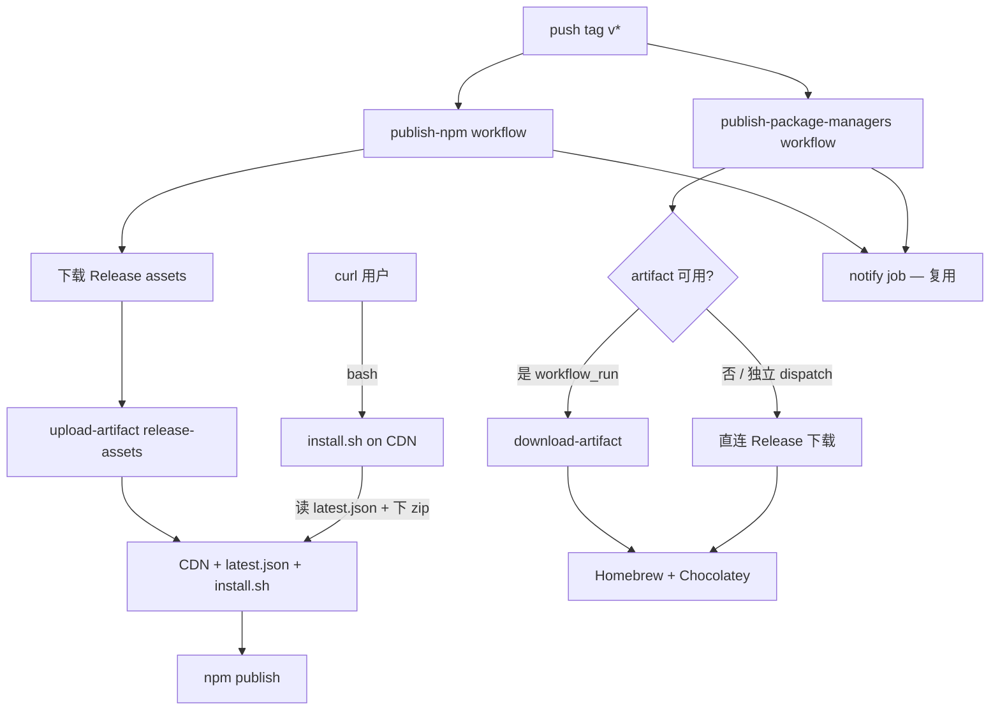

# everkm/publish — 多通道分发（curl / Homebrew / Chocolatey）— 架构设计（Plan）

> **文档性质**：方案评估 + 分阶段实施规划（2026-06-21）  
> **仓库**：GitHub [`everkm/publish`](https://github.com/everkm/publish)（`everkm-publish-npm` 仅为本地/历史别名）  
> **状态**：**M1 + M2 已实施**（2026-06-21），待首次发版验收  
> **关联**：[CDN 分发与 npm 发布 Plan](./260613-Plan-everkm-publish-npm-分发与发布.md)、[publish-npm.yaml](../../.github/workflows/publish-npm.yaml)、[publish-npm-package.py](../../scripts/publish-npm-package.py)、[install.js](../../install.js)、[everkm/homebrew-tap](https://github.com/everkm/homebrew-tap)

---

## 0. 变更记录

| 版本 | 日期 | 说明 |
|------|------|------|
| 0.1 | 2026-06-21 | 初稿：评估 Homebrew / Chocolatey / Winget / APT 四渠道可行性；对齐现有 Release → CDN → npm 编排模式；分阶段实施建议 |
| 0.2 | 2026-06-21 | 确认决策：tap 仓库、Formula 形态、Chocolatey 包名 `everkm`、artifact 共享 + 独立 dispatch、notify 复用；Winget / APT 暂不实施 |
| 0.3 | 2026-06-21 | Chocolatey 包 id 更正为 `everkm-publish`，与 npm / brew 命名一致 |
| 0.4 | 2026-06-21 | 新增 curl 脚本安装（Phase 1，与 Homebrew 并行）；单脚本覆盖 Linux + macOS；归入 npm/CDN workflow 发布 |
| 0.5 | 2026-06-21 | M1 实施：`scripts/install.sh`、`publish-npm-package.py` CDN 上传、`publish-homebrew.py`、`publish-package-managers.yaml`、`publish-npm.yaml` artifact |
| 0.6 | 2026-06-21 | M2 实施：`publish-chocolatey.py`、`chocolatey.nuspec.j2`、workflow 拆分 homebrew/chocolatey job |

---

## 1. 一句话

**在现有 push `v{ver}` 触发的 CDN + npm 编排之上，复用同仓 Release zip 资产：CDN 托管 `install.sh` 供 `curl \| bash` 安装（Linux + macOS）；并自动生成 Homebrew Formula 与 Chocolatey 包推送；包管理器 workflow 支持独立手动触发；Winget / APT 暂不纳入。**

---

## 2. 背景与问题

### 2.1 现状

| 环节 | 当前实现 | 问题 |
|------|----------|------|
| 二进制构建 | 本仓库 tag `everkm-publish@v*` → CI 构建多平台 zip | ✅ 保留 |
| 二进制分发 | GitHub Release + R2 / 七牛 CDN（`pkgs/{ver}/`） | ✅ 已自动化（见 §260613 Plan） |
| npm 安装 | `npm i -g everkm-publish` + `postinstall` 三源下载 | ✅ 开发者友好；需 Node 环境 |
| curl 脚本安装 | 无 | 无 Node / brew 用户无法「一条命令」安装 |
| Homebrew / Chocolatey | 无 | 无法用 `brew` / `choco` 安装 |

### 2.2 目标

1. **复用已有 Release 资产**：workflow **不**重复编译，只读 `everkm-publish@v{ver}` Release 附件。
2. **对齐现有编排**：与 [publish-npm.yaml](../../.github/workflows/publish-npm.yaml) 同触发条件（push `v{ver}`），包管理器独立 workflow 并行执行。
3. **分阶段落地**：Phase 1 **curl 脚本 + Homebrew Tap**；Phase 2 Chocolatey。
4. **版本一致**：各渠道版本号与 semver tag、`npm` 版本、Release tag 保持一致。
5. **幂等与可重跑**：各渠道已发布同版本时 skip 或安全覆盖。
6. **artifact 共享**：常规发版时包管理器 job 与 npm job 共享已下载 zip。
7. **独立部署**：包管理器 workflow 支持 `workflow_dispatch`，不依赖 npm job 即可单独发布。

### 2.3 非目标

- 不在本方案中改变二进制构建流程（仍由 `everkm-publish@v*` 负责）。
- 不以新渠道替代 npm（npm 仍是跨平台最省心的主渠道）。
- 首版不强制支持 `linux arm64`（与 [install.js](../../install.js) 当前平台矩阵一致）。
- **curl 脚本不覆盖 Windows**（Windows 用 Chocolatey；Git Bash/WSL 非首版目标）。
- **Winget、APT 暂不实施**（见 §6.4）。

### 2.4 渠道分工（用户视角）

| 用户场景 | 推荐渠道 |
|----------|----------|
| Node 开发者 | `npm i -g everkm-publish` |
| macOS / Linux，已装 Homebrew | `brew install everkm-publish` |
| macOS / Linux，零依赖 Quick Start | `curl -fsSL …/install.sh \| bash` |
| Windows | `choco install everkm-publish` |
| CI / 脚本化 | curl 或 npm |

---

## 3. 与现有 npm 编排的对照

现有 [publish-npm-package.py](../../scripts/publish-npm-package.py) 已实现「Release → 下载 → 加工 → 发布」模式：

```text
push tag v{ver}
  → fetch_release(everkm/publish, everkm-publish@v{ver})
  → 下载全部 assets → publish-artifacts/{ver}/
  → upload-artifact（供包管理器共享）
  → 上传 R2 + 七牛 pkgs/{ver}/ + latest.json
  → 上传 install.sh → pkgs/install.sh（新增）
  → npm publish
```

各分发渠道与之 **同构**，仅「加工」与「发布」不同：

| 步骤 | npm / CDN 流程 | curl 脚本 | 包管理器流程 |
|------|---------------|-----------|-------------|
| 触发 | push `v{ver}` | push `v{ver}`（随 npm workflow） | push `v{ver}` 并行 + PM `workflow_dispatch` |
| 读 Release / latest | Release + `latest.json` | 运行时读 `pkgs/latest.json` | 同左或 artifact |
| 获取 zip | 下载 → CDN | 脚本内按平台下载 zip | artifact 或直连 Release |
| 加工 | CDN 元数据 | 解压 → 装 `~/.local/bin` | Formula / nupkg |
| 发布 | npm publish | 无（用户本机执行） | push tap / `choco push` |

**curl 脚本本质**：shell 版 [install.js](../../install.js)，不引入新二进制格式。

---

## 4. 整体架构

### 4.1 发版 SOP（在 §260613 基础上扩展）

```bash
# 1. 发布二进制 Release（不变）
git tag everkm-publish@v0.17.0
git push origin everkm-publish@v0.17.0
# 等待构建完成，确认 Release 资产 + notes

# 2. 触发 CDN + npm + install.sh + 包管理器
git tag v0.17.0
git push origin v0.17.0

# 3. 用户安装
curl -fsSL https://ekmp-assets.everkm.com/install.sh | bash          # Phase 1
brew tap everkm/tap && brew install everkm-publish                      # Phase 1
choco install everkm-publish                                            # Phase 2
npm i -g everkm-publish                                                 # 现有

# 4. 指定版本安装（curl）
curl -fsSL https://ekmp-assets.everkm.com/install.sh | bash -s -- --version 0.17.0
# 或：EVERKM_PUBLISH_VERSION=0.17.0 curl -fsSL … | bash

# 5. 仅补发包管理器（不跑 npm / CDN）
# GitHub Actions → Publish Package Managers → Run workflow → 指定 version
```

### 4.2 workflow 拓扑



**职责拆分**：

| workflow | 负责 |
|----------|------|
| `publish-npm.yaml` | CDN、**`install.sh` 上传**、npm、artifact |
| `publish-package-managers.yaml` | Homebrew tap、Chocolatey（失败不阻塞 npm） |

---

## 5. Release 资产约定（沿用 §260613）

### 5.1 平台 zip 命名

| 平台键 | zip 文件名 | 解压后二进制 |
|--------|------------|--------------|
| `darwin arm64` / `darwin x64` | `EverkmPublish_{ver}_darwin-universal.zip` | `everkm-publish.bin` |
| `linux x64` | `EverkmPublish_{ver}_linux-amd64.zip` | `everkm-publish.bin` |
| `win32 x64` | `EverkmPublish_{ver}_windows-amd64.zip` | `everkm-publish.exe` |

### 5.2 与通用方案的差异

外部方案常假设裸二进制。本仓库资产为 **zip 包**，curl / brew / choco pipeline 均须解压或引用 zip URL 后在 install 阶段解压。

### 5.3 下载 URL

| 顺位 | 用途 | URL 模板 |
|------|------|----------|
| 1 | curl 脚本 / Homebrew / Chocolatey 主源 | `https://github.com/everkm/publish/releases/download/everkm-publish%40v{ver}/{asset_name}` |
| 2 | curl 脚本回退（与 install.js 一致） | `https://ekmp-assets.everkm.com/pkgs/{ver}/{asset_name}` |
| 3 | curl 脚本国内回退 | `https://ekmp-assets.everkm.cn/pkgs/{ver}/{asset_name}` |

---

## 6. 分平台方案

### 6.1 curl 脚本安装 — Phase 1

业内主流：**单个 shell 脚本 + 运行时 `uname` 检测 + 下载对应 zip + 安装到 PATH**（Rust `rustup.rs`、Homebrew `install.sh`、Starship 等均采用此模式）。

| 项 | 说明 |
|----|------|
| 脚本路径（源码） | [`scripts/install.sh`](../../scripts/install.sh) |
| CDN 托管 URL | `https://ekmp-assets.everkm.com/install.sh`（latest，固定路径） |
| 版本 pin（可选） | `https://ekmp-assets.everkm.com/pkgs/{ver}/install.sh` |
| 发布 | [publish-npm-package.py](../../scripts/publish-npm-package.py) 上传 R2 + 七牛（随 CDN 发版） |
| 用户命令 | `curl -fsSL https://ekmp-assets.everkm.com/install.sh \| bash` |
| 平台 | **Linux x64 + macOS（universal）**；同一脚本内分支 |
| Windows | 脚本内提示使用 `choco install everkm-publish`，不尝试在 cmd 环境安装 |

**单脚本同时支持 Linux & macOS（业内标准）**：

```bash
os="$(uname -s | tr '[:upper:]' '[:lower:]')"
arch="$(uname -m)"

case "$os" in
  darwin)
    pkg_suffix="darwin-universal.zip"
    bin_src="everkm-publish.bin"
    ;;
  linux)
    case "$arch" in
      x86_64|amd64) pkg_suffix="linux-amd64.zip"; bin_src="everkm-publish.bin" ;;
      *) fatal "unsupported linux arch: $arch" ;;
    esac
    ;;
  *)
    fatal "unsupported OS: $os (Windows: choco install everkm-publish)"
    ;;
esac
```

与 [install.js](../../install.js) 平台矩阵一致，不单独维护第二套映射表。

**脚本执行流程**：

```text
1. set -euo pipefail；整段逻辑包在 main 函数内（防半截下载执行）
2. 解析版本：默认 GET pkgs/latest.json → .version；或 --version / $EVERKM_PUBLISH_VERSION
3. uname 检测 → 构造 asset 名 EverkmPublish_{ver}_{pkg_suffix}
4. 三源顺序下载 zip（.com → GitHub Release → .cn），curl 优先、wget fallback
5. sha256 校验（读 meta.json 或脚本内嵌表；与 install.js 同源数据）
6. unzip → 安装到 ${INSTALL_DIR:-$HOME/.local/bin}，chmod +x，命名为 everkm-publish
7. 若 INSTALL_DIR 不在 PATH → 打印 export 提示；可选追加 .bashrc / .zshrc（幂等检测）
8. 打印 everkm-publish --version 验证
```

**安全约定**（务实平衡，与 Rust/Homebrew 等一致）：

| 项 | 做法 |
|----|------|
| 传输 | HTTPS only；文档推荐 `curl -fsSL` |
| 完整性 | 下载 zip 后 sha256 校验 |
| 权限 | 默认 **不** sudo；装到 `~/.local/bin` |
| 文档 | 同时提供「先下载审查」：`curl -o install.sh && less install.sh && bash install.sh` |

**可行性**：⭐⭐⭐⭐⭐ | **工作量**：低（~100 行 shell + CDN 上传一步） | **依赖**：unzip/curl（macOS/Linux 常见预装）

### 6.2 Homebrew Tap — Phase 1

| 项 | 说明 |
|----|------|
| 仓库 | [`everkm/homebrew-tap`](https://github.com/everkm/homebrew-tap)（org `everkm`，已创建） |
| 产物 | `Formula/everkm-publish.rb` |
| 发布 | CI push 到 tap 仓库 `main` |
| Secret | `GH_TOKEN`（已有，需 tap 仓库 write 权限） |
| 用户命令 | `brew tap everkm/tap` → `brew install everkm-publish` |

**Formula 形态（已确认）**：单文件 + `on_macos` / `on_linux` 块（[Formula Cookbook](https://docs.brew.sh/Formula-Cookbook) 官方推荐）。

**可行性**：⭐⭐⭐⭐⭐ | **工作量**：低 | **审核**：无（自建 tap）

结构示例见 v0.3 §6.1（略）。

### 6.3 Chocolatey — Phase 2

| 项 | 说明 |
|----|------|
| 包 id | **`everkm-publish`**（已确认） |
| 产物 | `everkm-publish.nuspec` + `tools/everkm-publish.exe` |
| 发布 | `choco push --source https://push.chocolatey.org/` |
| Secret | `CHOCO_API_KEY` |
| 用户命令 | `choco install everkm-publish` |

**可行性**：⭐⭐⭐⭐ | **工作量**：中

### 6.4 暂不实施

| 渠道 | 原因 |
|------|------|
| Winget | PR 审核、无 push API；Chocolatey 已覆盖 Windows |
| APT（GitHub Pages） | 维护成本高；Linux 用户可用 curl / brew / npm |
| curl 覆盖 Windows | PowerShell 安装脚本另立项；首版引导 choco |

---

## 7. 触发与 workflow 设计

### 7.1 触发

| 触发 | workflow | 行为 |
|------|----------|------|
| **`push.tags: v*`** | `publish-npm.yaml` | CDN + **`install.sh` 上传** + npm + upload-artifact |
| **`push.tags: v*`** | `publish-package-managers.yaml` | Homebrew / Chocolatey |
| **`workflow_dispatch`** | `publish-package-managers.yaml` | 仅包管理器；直连 Release |
| **`workflow_dispatch`** | `publish-npm.yaml` | 现有（`skip_npm` / `force_cdn`）；`force_cdn` 时重传 `install.sh` |

### 7.2 install.sh CDN 发布（publish-npm 增量）

在 [publish-npm-package.py](../../scripts/publish-npm-package.py) 中追加：

| 对象 | CDN key | URL |
|------|---------|-----|
| latest 入口 | `install.sh` | `https://ekmp-assets.everkm.com/install.sh` |
| 版本 pin（可选） | `pkgs/{ver}/install.sh` | `https://ekmp-assets.everkm.com/pkgs/{ver}/install.sh` |

脚本内容来自仓库 `scripts/install.sh`（**不**随版本生成；版本由运行时读 `latest.json` 决定）。发版时只要 CDN workflow 成功，`install.sh` URL 始终指向最新逻辑。

七牛 `cdnrefresh` 追加 `install.sh` 与国内镜像路径。

### 7.3 artifact 共享与独立部署

（包管理器 workflow，与 v0.3 相同，略。）

npm workflow 增量：

```yaml
- name: Upload release assets for package managers
  uses: actions/upload-artifact@v4
  with:
    name: release-assets-${{ steps.ver.outputs.version }}
    path: publish-artifacts/${{ steps.ver.outputs.version }}/
    retention-days: 7
```

### 7.4 所需 Secrets

| Secret | 用途 | 阶段 |
|--------|------|------|
| `CF_S3_AK` / `CF_S3_SK` / `QINIU_*` | CDN 上传 `install.sh` | Phase 1（已有） |
| `GH_TOKEN` | 读 Release、push homebrew-tap | Phase 1（已有） |
| `CHOCO_API_KEY` | `choco push` | Phase 2 |
| `NOTIFY_DAYU_ENDPOINT` | Telegram（复用） | Phase 1 |

### 7.5 notify（已确认：复用）

包管理器 workflow 末尾复用 [publish-npm.yaml](../../.github/workflows/publish-npm.yaml) 相同 notify 结构；curl 脚本发布失败随 npm workflow notify 一并上报。

---

## 8. 脚本规划

### 8.1 文件规划

| 文件 | 用途 | 阶段 |
|------|------|------|
| **`scripts/install.sh`** | curl 安装脚本（Linux + macOS） | **Phase 1** |
| `scripts/publish-homebrew.py` | sha256、渲染 Formula、push tap | Phase 1 |
| `scripts/publish-chocolatey.py` | 打 nupkg、`choco push` | Phase 2 |
| `templates/homebrew-formula.rb.j2` | Formula 模板 | Phase 1 |
| `templates/chocolatey.nuspec.j2` | nuspec 模板 | Phase 2 |
| `.github/workflows/publish-package-managers.yaml` | Homebrew / Chocolatey + notify | Phase 1 |

[publish-npm-package.py](../../scripts/publish-npm-package.py) 增量：上传 `scripts/install.sh` → CDN `install.sh` + `pkgs/{ver}/install.sh`。

### 8.2 install.sh 职责（Phase 1）

```text
# 常量（与 install.js 对齐）
CDN_COM / CDN_CN / BINARY_RELEASE_REPO
INSTALL_DIR 默认 $HOME/.local/bin

# 输入
--version VER | $EVERKM_PUBLISH_VERSION | 默认 latest.json
--prefix DIR  覆盖安装目录

# 逻辑
detect_platform → resolve_version → download_zip（三源）→ verify_sha256
→ unzip → install binary → verify --version → print PATH hint
```

不依赖 Node、Python、brew。

### 8.3 publish-homebrew.py 职责（Phase 1）

（与 v0.3 相同，略。）

---

## 9. 风险与已确认决策

### 9.1 风险

| 风险 | 缓解 |
|------|------|
| `curl \| bash` 安全争议 | sha256 校验 + 文档提供先下载审查流程 |
| zip 非裸二进制 | 脚本内 unzip；与 install.js 一致 |
| Homebrew darwin vs linux 不同 sha256 | Formula `on_macos` / `on_linux` |
| install.sh 与 latest.json 版本不同步 | 同一 workflow 原子发布 |
| 目标机无 unzip | 脚本检测并提示安装 `unzip` |
| linux arm64 未支持 | 与 install.js 一致，脚本明确报错 |
| Chocolatey 审核延迟 | 独立 workflow，不阻塞 npm |

### 9.2 已确认决策

| # | 问题 | 决策 |
|---|------|------|
| 1 | Homebrew tap 仓库 | [`everkm/homebrew-tap`](https://github.com/everkm/homebrew-tap)，**org** `everkm` |
| 2 | Formula 单文件 vs 拆分 | **单文件** + `on_macos` / `on_linux` |
| 3 | Chocolatey 包 id | **`everkm-publish`** → `choco install everkm-publish` |
| 4 | artifact 共享 | 共享 + 包管理器 **独立** `workflow_dispatch` |
| 5 | notify | **复用**现有结构 |
| 6 | Winget / APT | **暂不实施** |
| 7 | curl 脚本平台 | **单脚本** 覆盖 **Linux x64 + macOS**；Windows 引导 choco |
| 8 | curl 脚本托管 | CDN 固定 URL `…/install.sh`；版本由 `latest.json` 或参数指定 |
| 9 | curl 与 npm 发版 | 归入 **publish-npm workflow**（非 package-managers workflow） |

---

## 10. 实施顺序

| 阶段 | 内容 | 验收 |
|------|------|------|
| **M1** | `scripts/install.sh` + [publish-npm-package.py](../../scripts/publish-npm-package.py) 上传 CDN + [`everkm/homebrew-tap`](https://github.com/everkm/homebrew-tap) + `publish-homebrew.py` + package-managers workflow | macOS / Linux：`curl … \| bash` 后 `everkm-publish --version` 成功；`brew install everkm-publish` 成功 |
| **M1 状态** | ✅ 已编码（2026-06-21） | 待 push `v*` 发版验收 |
| **M2** | Chocolatey `everkm-publish` nuspec + `publish-chocolatey.py` | `choco install everkm-publish` 可用 |
| **M2 状态** | ✅ 已编码（2026-06-21） | 需配置 `CHOCO_API_KEY`；待 push `v*` 发版验收 |

M1 内 **curl 与 Homebrew 可并行开发**；curl 仅改 npm workflow，Homebrew 改 package-managers workflow。

---

## 11. 评估结论（摘要）

| 维度 | 结论 |
|------|------|
| **技术可行性** | ✅ 高；curl 脚本 = shell 版 install.js，零新二进制格式 |
| **实施范围** | M1：curl + Homebrew；M2：Chocolatey；Winget / APT 不做 |
| **curl 跨平台** | ✅ 单脚本 Linux + macOS；Windows → choco |
| **触发方式** | curl 随 npm；brew/choco 独立 workflow + dispatch |
| **Formula 形态** | 单文件 + `on_macos` / `on_linux` |
| **notify** | 复用 publish-npm 同一套 |

**M1 + M2 代码已合入；发版验收见 §4.1 SOP。**
